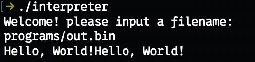

# Hello, World!
Hi, this is a joke program that let's you use an assembler to create programs that can only print "Hello, World!" using the HELLOWORLD instruction, and execute them inside an interpreter.

## Building:
To build the program you need to run make.
If you are not on MacOS you should use C and C++ compilers for your OS.
You will need to build main.c for the interpreter and assembler/main.cpp for the assembler.

## Instructions:
| Binary | Assembly | Description |
| 0x1    | HELLOWORLD | prints "Hello, World!" to stdout. |
| 0x2    | EXIT | exits execution. |
